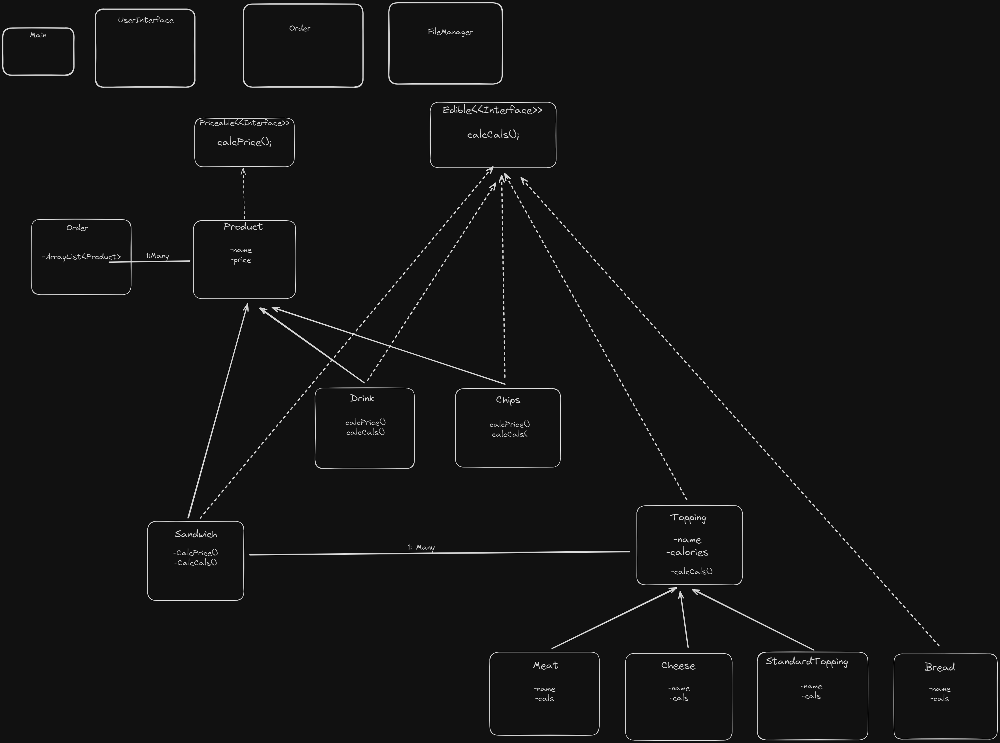

Aycan Bilge's CapStone Two:
-
In this project, users are able to select multiple options in the Deli such as pruchase chips, drink, a sandwich, or all three!
-
Users can add multiple products to their order total, which is printed out for them to confirm their order specifications.

An XML Diagram of my project, focusing on implementing two interfaces to optimally calculate calories, and utilize inheritence to have multiple Topping types.

-An interesting peice of my code that I liked, although not the biggest feature, is the way my toppings are presented to the user as a list which reduces with each topping selected. I really liked the way this function appeared, however I also like it because it made me realize how else I could have deisgned the program, as I could have made ingredients as a static method so every sandwich could have the same preset ingredient set which, which could be very beneficial if an inventory system were to be implemented later on.